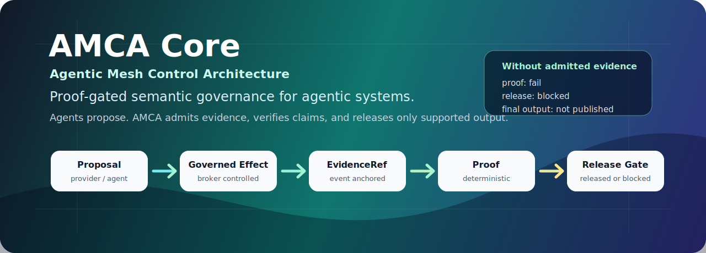

<p align="center">
  
</p>

<h1 align="center">AMCA Core</h1>

<p align="center">
  <strong>Agentic Mesh Control Architecture</strong><br />
  A proof-gated semantic governance kernel for agentic systems.
</p>

<p align="center">
  <a href="LICENSE"></a>
  
  
  
</p>

<p align="center">
  <a href="#run-it-in-two-minutes">Quick Start</a> ·
  <a href="docs/runnable-demos.md">Runnable Demos</a> ·
  <a href="docs/visual-guide.md">Visual Guide</a> ·
  <a href="docs/architecture.md">Architecture</a> ·
  <a href="docs/threat-model.md">Threat Model</a>
</p>

Agent SDKs help agents act. AMCA governs what agents are allowed to claim.

AMCA turns provider, framework, tool, and adapter output into governed
proposals, admits evidence through typed events, verifies structured claims
deterministically, and releases only supported outputs.

```text
provider or agent proposes
  -> AMCA validates
  -> broker governs effects
  -> kernel admits receipts and evidence
  -> proof engine verifies structured claims
  -> release gate publishes only supported outputs
```

## The Problem

Modern agent frameworks make it easy to call tools, coordinate workflows, and
produce fluent answers. That still leaves an authority problem:

```text
Did the action really happen?
Was the result admitted as evidence?
Does the evidence belong to this run?
Is it fresh enough for the claim?
Can the final answer be proven before release?
```

AMCA is the control layer for those questions. The model can reason, the
framework can orchestrate, and tools can return data, but none of them become
AMCA authority by themselves.

## Run It In Two Minutes

Install dependencies:

```bash
pnpm install --frozen-lockfile
```

Run the no-network proof/release demo:

```bash
pnpm demo:proof-release
```

Expected terminal shape:

```text
AMCA proof-release demo completed.
timestamp: ...
sourceCommitAtRunStart: ...
outputDir: .amca/demo-runs/proof-release/...
supportedRun.release: released
blockedRun.release: blocked
supportedRun.events: RunStarted -> ProposalReceived -> EffectRequested -> EffectReceiptRecorded -> ProposalReceived -> ProofGenerated -> ReleaseDecided -> FinalReleased
blockedRun.events: RunStarted -> ProposalReceived -> ProofGenerated -> MismatchDetected -> ReleaseDecided
```

The command writes timestamped artifacts under `.amca/demo-runs/proof-release/`,
including:

```text
events.json
admitted-evidence-ref.json
proof.json
release-decision.json
final-released-event.json
blocked-proof.json
blocked-release-decision.json
verification-record.json
timeline.md
```

That is the shortest way to see AMCA’s core promise: the same claim is released
when backed by admitted evidence and blocked when it has no evidence.

## Core Architecture

```mermaid
flowchart LR
  User["User / App"] --> Provider["Provider or Agent Runtime"]
  Provider --> Proposal["Proposal Candidate"]
  Proposal --> Contracts["Strict Contract Validation"]
  Contracts --> Harness["Governed Harness"]
  Harness --> Broker["Effect Broker"]
  Broker --> Adapter["Tool / Adapter / Local Compute"]
  Adapter --> Candidate["Receipt or Observation Candidate"]
  Candidate --> Kernel["Kernel Admission"]
  Kernel --> Evidence["Admitted EvidenceRef"]
  Evidence --> Final["FinalCandidate Claims"]
  Final --> Proof["Deterministic Proof"]
  Proof --> Gate["Release Gate"]
  Gate --> Output["Released Output or Blocked Result"]

  Provider -. "not proof authority" .-> Proof
  Adapter -. "candidate only" .-> Proof
  Candidate -. "not proof before admission" .-> Proof
```



The invariant:

```text
Agents reason.
The harness validates.
The broker controls effects.
The kernel admits accepted events.
The ledger anchors history.
The proof engine verifies.
The release gate publishes.
```

## Code Shape

The executable demo in
[`packages/testing/src/demo/proof-release.ts`](packages/testing/src/demo/proof-release.ts)
uses this shape:

```ts
const dispatch = await harness.dispatchToolCommand(toolCommand);
const evidenceRef = dispatch.recordedReceipt.evidence[0];

const finalCandidate = {
  kind: "final_candidate",
  runId,
  candidateId: "candidate_supported",
  claims: [
    {
      claimId: "claim_tests_passed",
      type: "test_result",
      statement: "Tests passed.",
      predicate: {
        kind: "test_result",
        capabilityId: "amca.demo.run_tests",
        expectedStatus: "passed",
        requiredReceiptType: "test_run",
        testSuiteId: "public-proof-release-demo",
      },
      evidenceRefs: [evidenceRef],
      criticality: "medium",
    },
  ],
};

const result = harness.submitFinalCandidate(finalCandidate);
```

AMCA does not prove from `statement`. It proves from `predicate` plus admitted
`evidenceRefs`.

## What AMCA Controls

| Boundary         | AMCA rule                                                                              |
| ---------------- | -------------------------------------------------------------------------------------- |
| Provider output  | Proposal-only. It cannot admit receipts, generate proof, release output, or mutate.    |
| Tool output      | Candidate-only until AMCA records an accepted semantic event.                          |
| Evidence         | Must be typed, hashed, source-event-bound, and tied to the run.                        |
| Current state    | Requires fresh external observations, not stale historical receipts.                   |
| Final claims     | Must be structured claims with predicates and evidence references.                     |
| Release          | Published only after deterministic proof and a release decision.                       |
| Framework state  | LangGraph, Temporal, provider traces, telemetry, audit, and replay are non-proof.      |
| Domain extension | Domain logic must stay outside AMCA Core unless a generic design decision requires it. |

## What AMCA Is Not

AMCA Core is not:

- a model provider;
- an agent orchestration framework replacement;
- a production certification for every adapter or cloud provider;
- a financial, medical, legal, or compliance decision engine;
- a license to let models execute writes directly.

AMCA can sit beside systems such as OpenAI Agents SDK, LangGraph, Temporal,
Pydantic AI, or custom agent stacks as the admissibility and release-governance
layer.

## Optional Local Provider Flight Recorder

If you have an OpenAI-compatible local provider available:

```bash
AMCA_PROVIDER_LIVE=1 \
AMCA_PROVIDER_BASE_URL=http://localhost:11434/v1 \
AMCA_PROVIDER_MODEL=code \
AMCA_PROVIDER_API_KEY=<local-placeholder> \
pnpm demo:flight-recorder
```

The recorder writes local artifacts under `.amca/demo-runs/`, which is ignored
by git. It does not claim cloud-provider certification, production provider
certification, GitHub certification, Temporal certification, or production
deployment readiness.

## Packages

| Package                  | Purpose                                                                      |
| ------------------------ | ---------------------------------------------------------------------------- |
| `@amca/protocol`         | Protocol types for proposals, effects, evidence, proof, release, and events. |
| `@amca/contracts`        | Strict parsers and contract validation.                                      |
| `@amca/proof`            | Deterministic proof rules.                                                   |
| `@amca/kernel`           | Run kernel, release gate, and event handling.                                |
| `@amca/effect-broker`    | Governed effect lifecycle.                                                   |
| `@amca/harness`          | Local governed run harness.                                                  |
| `@amca/ledger-*`         | Semantic ledger interfaces and adapters.                                     |
| `@amca/adapters-*`       | Adapter boundary and conformance packages.                                   |
| `@amca/provider-harness` | Proposal-boundary provider integration.                                      |
| `@amca/security`         | Permission, redaction, and tenant boundaries.                                |
| `@amca/observability`    | Operations telemetry that remains non-proof.                                 |
| `@amca/service`          | Local service boundary.                                                      |
| `@amca/testing`          | Mission and anti-mission tests.                                              |

## Documentation

- [Architecture](docs/architecture.md)
- [Visual Guide](docs/visual-guide.md)
- [Use Cases](docs/use-cases.md)
- [Runnable Demos](docs/runnable-demos.md)
- [Getting Started](docs/getting-started.md)
- [Core Concepts](docs/concepts.md)
- [Adapters](docs/adapters.md)
- [Provider Harness](docs/provider-harness.md)
- [Ledger](docs/ledger.md)
- [Threat Model](docs/threat-model.md)
- [Anti-Mission Tests](docs/anti-mission-tests.md)
- [Package Boundaries](docs/package-boundaries.md)

## Repository Status

This public repository is an alpha release of the AMCA Core framework.

Some packages include optional adapters or live-integration tests. Those tests
are gated behind explicit environment variables and do not imply production
certification.

## License

Apache-2.0. See [LICENSE](LICENSE).
