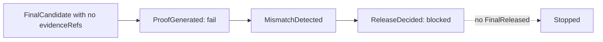
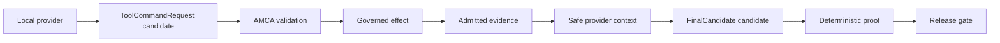

# Runnable Demos

This page lists demos that users can run locally and inspect themselves. The
first demo does not require a model provider, network access, Docker, a
database, or credentials.

## Demo 1: Proof-Gated Release

Run:

```bash
pnpm demo:proof-release
```

What it does:

```mermaid
flowchart LR
  TC["ToolCommandRequest"] --> ER["EffectRequested"]
  ER --> RC["Deterministic local compute"]
  RC --> RR["EffectReceiptRecorded"]
  RR --> EV["Admitted EvidenceRef"]
  EV --> FC["FinalCandidate"]
  FC --> PR["ProofGenerated: pass"]
  PR --> RD["ReleaseDecided: released"]
  RD --> FR["FinalReleased"]
```



In the same command, AMCA also runs an attack path:



Expected terminal shape:

```text
AMCA proof-release demo completed.
timestamp: ...
sourceCommitAtRunStart: ...
outputDir: .amca/demo-runs/proof-release/...
supportedRun.release: released
blockedRun.release: blocked
supportedRun.events: RunStarted -> ProposalReceived -> EffectRequested -> EffectReceiptRecorded -> ProposalReceived -> ProofGenerated -> ReleaseDecided -> FinalReleased
blockedRun.events: RunStarted -> ProposalReceived -> ProofGenerated -> MismatchDetected -> ReleaseDecided
```

The command writes a timestamped record under:

```text
.amca/demo-runs/proof-release/
```

Inspect these files after running it:

```text
README.md
commands-run.md
verification-record.json
timeline.md
events.json
events.jsonl
tool-command.json
effect-request-event.json
effect-receipt-recorded-event.json
admitted-evidence-ref.json
final-candidate.json
proof.json
release-decision.json
final-released-event.json
blocked-events.json
blocked-final-candidate.json
blocked-proof.json
blocked-release-decision.json
```

The important checks are:

```text
supported path:
  EffectReceiptRecorded exists
  EvidenceRef.sourceEventId points to that receipt event
  ProofGenerated verdict is pass
  ReleaseDecided status is released
  FinalReleased exists

blocked path:
  FinalCandidate has no evidenceRefs
  ProofGenerated verdict is fail
  MismatchDetected exists
  ReleaseDecided status is blocked
  FinalReleased does not exist
```

## Demo 2: Optional Local Provider Flight Recorder

Run this only when you have a local OpenAI-compatible provider available:

```bash
AMCA_PROVIDER_LIVE=1 \
AMCA_PROVIDER_BASE_URL=http://localhost:11434/v1 \
AMCA_PROVIDER_MODEL=code \
AMCA_PROVIDER_API_KEY=<local-placeholder> \
pnpm demo:flight-recorder
```

What it adds:



This demo records local provider completions and redacted AMCA artifacts under
`.amca/demo-runs/flight-recorder/`.

It does not claim cloud-provider certification, production provider
certification, GitHub certification, Temporal certification, or production
deployment readiness.
