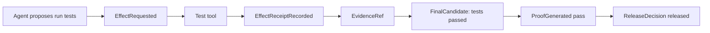
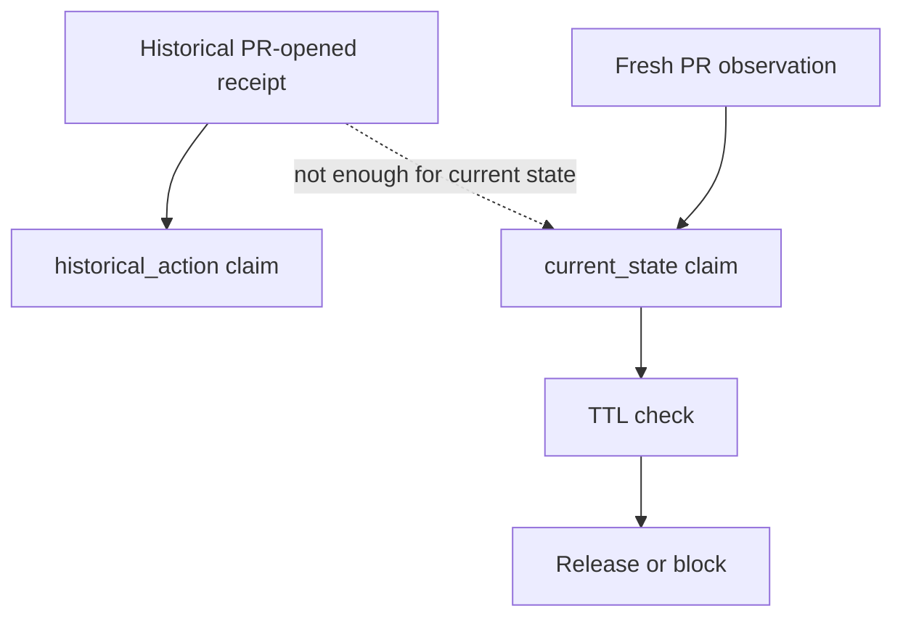
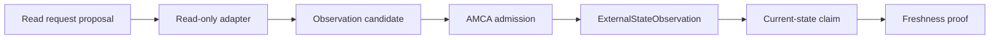
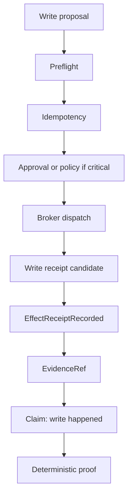
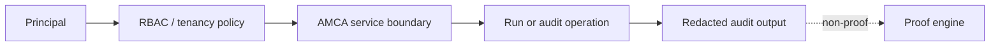
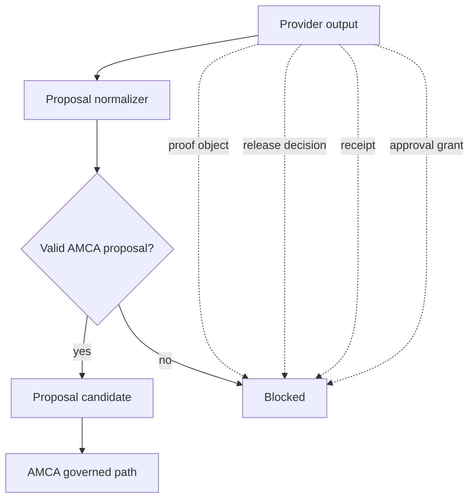
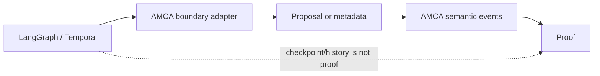
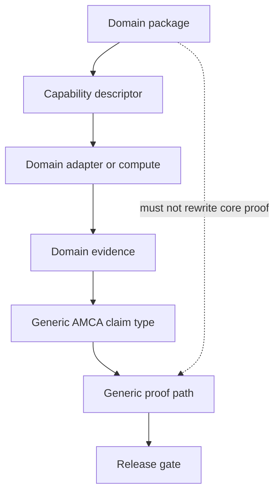
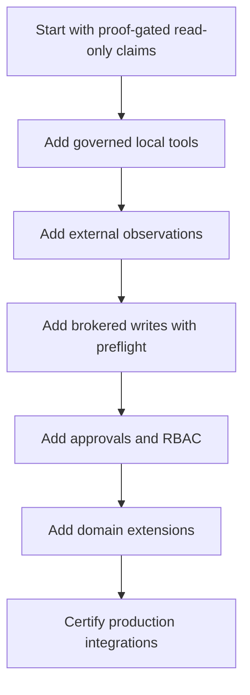

# Use Cases

AMCA Core is useful when an agentic system must do more than produce plausible
text. It is for systems where claims, effects, and external state need an
evidence-backed authority path.

## Best-Fit Customers

AMCA is most useful for teams building:

- agent platforms that call tools or APIs;
- internal automation that needs auditability;
- regulated or risk-sensitive agent workflows;
- multi-agent systems where one agent's output should not become truth by
  default;
- workflow systems that use LangGraph, Temporal, or agent SDKs but need a
  separate governance layer;
- enterprise teams that need proof, replay, redaction, RBAC, and release
  controls around agent actions.

It is less useful for low-risk chatbots where the output is purely advisory and
no tool result, external state, or durable claim is trusted.

## Use Case 1: Test Result Claims

Problem:

```text
The agent says "tests passed", but the app needs proof.
```

AMCA flow:



What AMCA blocks:

- "tests passed" without an admitted test receipt;
- a test receipt from another run;
- a failed test receipt claimed as passed;
- provider confidence used as proof.

Business impact:

```text
Engineering automation can publish status claims only when the evidence exists.
```

## Use Case 2: Current Pull Request State

Problem:

```text
The agent opened a PR earlier, but the user asks if the PR is currently open.
```

AMCA flow:



What AMCA blocks:

- historical action evidence used as current-state proof;
- stale observations;
- wrong PR or wrong repository evidence;
- provider trace IDs used as evidence.

Business impact:

```text
Users are not shown stale external-state claims as if they were current facts.
```

## Use Case 3: Read-Only External Observation

Problem:

```text
An agent needs to read a file or HTTP endpoint, but raw output should not
become proof or leak directly.
```

AMCA flow:



What AMCA blocks:

- path traversal or root escape;
- unsafe HTTP hosts or redirects;
- oversized raw bodies;
- pending observation candidates used as proof;
- stale current-state claims.

Business impact:

```text
Read access becomes governed evidence collection, not uncontrolled data
exfiltration.
```

## Use Case 4: External Write Governance

Problem:

```text
An agent may need to create a ticket, PR, comment, or other external write.
```

AMCA flow:



What AMCA blocks:

- write dispatch without preflight;
- duplicate writes without idempotency protection;
- write candidates used as proof before receipt admission;
- uncertain outcomes treated as success;
- critical writes without scoped approval.

Business impact:

```text
Agents can automate write workflows while preserving auditability and
fail-closed behavior.
```

## Use Case 5: Enterprise Audit And RBAC

Problem:

```text
Different users and services should not see or mutate every run, receipt, or
evidence object.
```

AMCA flow:



What AMCA blocks:

- cross-tenant run access;
- cross-tenant dispatch;
- restricted evidence exposure;
- audit output used as proof;
- secrets in telemetry or audit logs.

Business impact:

```text
Agent automation can be inspected and governed without turning audit exports
into truth authority.
```

## Use Case 6: Provider Proposal Boundary

Problem:

```text
The model can produce JSON that looks authoritative.
```

AMCA flow:



What AMCA blocks:

- raw final text only;
- provider-smuggled proof;
- provider-smuggled release decision;
- provider-smuggled receipt;
- provider metadata used as evidence.

Business impact:

```text
The model remains a reasoning engine, not an authority engine.
```

## Use Case 7: LangGraph Or Temporal Containment

Problem:

```text
Workflow runtimes have state, checkpoints, history, retries, and activity
results. Those are useful, but they should not become AMCA proof by default.
```

AMCA flow:



What AMCA blocks:

- checkpoint state as proof;
- Temporal history as proof;
- activity results as receipts before AMCA admission;
- runtime final text as released output.

Business impact:

```text
Teams can use established runtimes while preserving AMCA's authority model.
```

## Use Case 8: Domain Extension Validation

Problem:

```text
A team wants domain-specific automation without putting domain logic into AMCA
Core.
```

AMCA flow:



What AMCA blocks:

- domain-specific proof shortcuts inside AMCA Core;
- domain prose as proof;
- unsupported overbroad claims;
- domain output released without admitted evidence.

Business impact:

```text
Domain teams can extend AMCA without weakening the core governance model.
```

## Use Case Selection Matrix

| Need                                               | AMCA fit                        |
| -------------------------------------------------- | ------------------------------- |
| Agent only chats, no durable claims                | Low                             |
| Agent calls read-only tools and summarizes results | Medium                          |
| Agent makes claims about external systems          | High                            |
| Agent performs writes or mutations                 | High                            |
| Agent output must be audited or replayed           | High                            |
| Agent handles secrets, tenants, or approvals       | High                            |
| Domain-specific regulated workflows                | High, with domain certification |

## Adoption Pattern



The safest path is incremental: prove the authority boundary first, then add
more powerful adapters.
