# Visual Guide

This guide explains AMCA Core visually.

The diagrams are conceptual architecture diagrams. For concrete executed
records, run the local flight recorder:

```bash
AMCA_PROVIDER_LIVE=1 \
AMCA_PROVIDER_BASE_URL=http://localhost:11434/v1 \
AMCA_PROVIDER_MODEL=code \
AMCA_PROVIDER_API_KEY=<local-placeholder> \
pnpm demo:flight-recorder
```

The recorder writes local event/proof/release artifacts under `.amca/`.

## One-Screen Summary

```mermaid
flowchart LR
  U["User / App"] --> A["Agent or Provider"]
  A --> P["Proposal Candidate"]
  P --> C["AMCA Contract Validation"]
  C --> H["Governed Harness"]
  H --> B["Effect Broker"]
  B --> T["Tool / Adapter / Runtime"]
  T --> RC["Receipt or Observation Candidate"]
  RC --> K["AMCA Kernel Admission"]
  K --> E["Admitted EvidenceRef"]
  E --> F["FinalCandidate Claims"]
  F --> PR["Deterministic Proof"]
  PR --> RG["Release Gate"]
  RG --> OUT["Released Answer or Blocked Result"]

  A -. "not authority" .-> PR
  T -. "not proof before admission" .-> PR
```

The important idea:

```text
The model may propose.
The tool may return.
AMCA decides what is admissible, provable, and releasable.
```

## Authority Spine

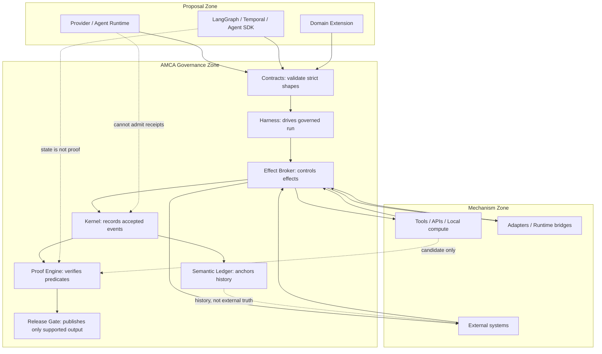

## Data Flow

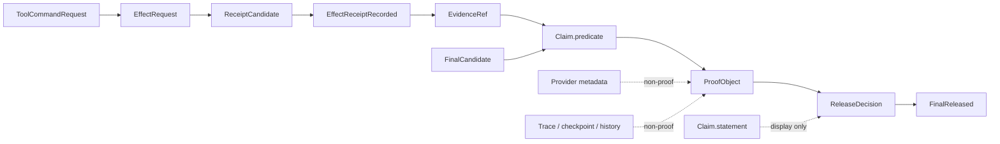

`Claim.statement` can be useful display text, but proof uses structured
`Claim.predicate` plus admitted `EvidenceRef` values.

## Supported Claim Sequence

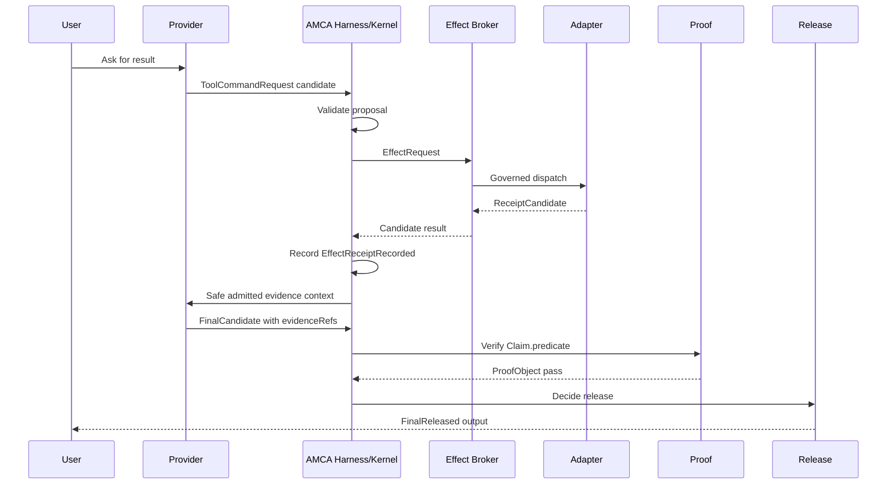

## Blocked Claim Sequence

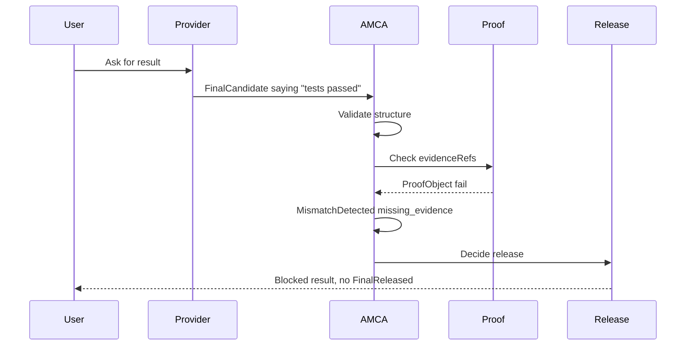

Same words, different authority status:

```text
With admitted evidence: release can pass.
Without admitted evidence: release blocks.
```

## Candidate vs Admitted Evidence

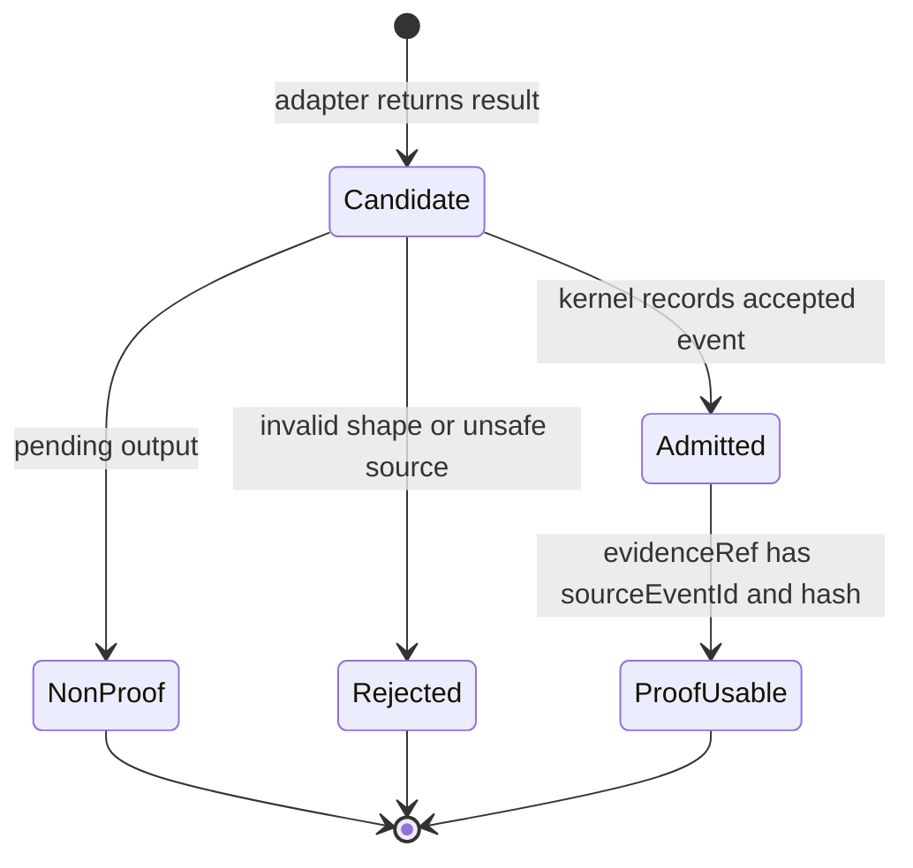

Adapters produce candidates. AMCA admission turns valid candidates into
event-anchored evidence.

## Current-State Freshness

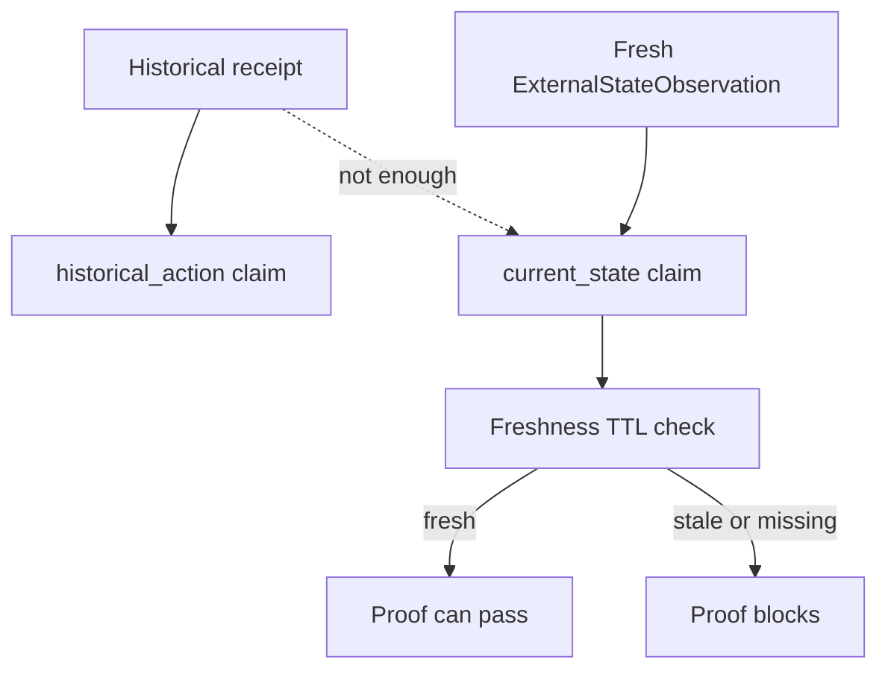

Historical facts and current-state facts are different. A receipt that something
happened earlier does not prove what is true now.

## External Write Path

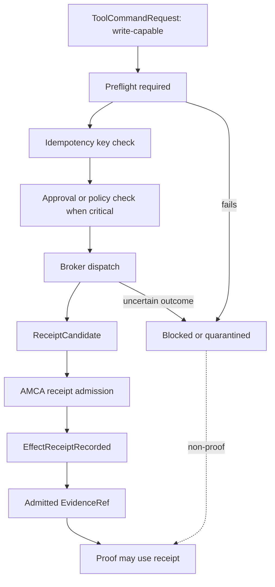

The write path is stricter because external side effects are harder to undo.

## Runtime Substrates

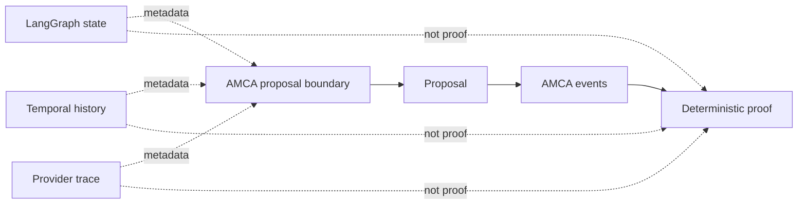

Frameworks execute workflows. AMCA governs whether outputs become accepted
events and evidence.

## Package Map

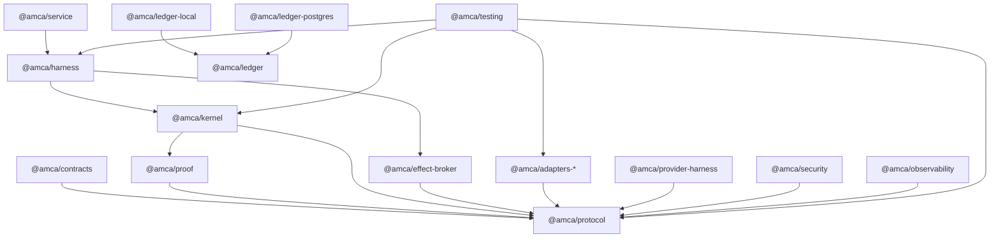

## What Users See

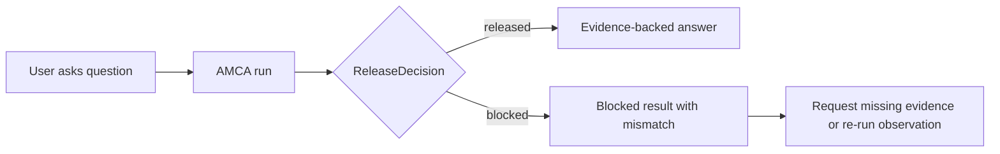

AMCA does not make every answer succeed. It makes success explainable and
failure actionable.
